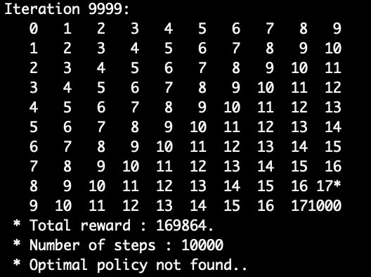

# Environmenet :

* 10 x 10.
* 10000 itérations
*  1000 épisodes

## Sparse
Marche bien mieux pour des plus petits environement. Très dépend du nombre d'itérations réalisé.

* Reward sparse = 0

## Heuristics
Heuristics utilisé: mahantan distance inversé pour que le plus proche de la fin soit le mieux.

Reward plus grand attribué à la dernière étape.

* Reward heuristics = 169864. Mais pas d'optimal policy trouvé. Ils préfèrent stagner à l'avant derniere :

	* Arrive particulièrement quand la solution est difficile à trouver. Si on a une taille plus grand, il va se caler contre un mur et répéter la même étape..
	* Excatement comme prévu, pour size = 100, il fait une boucle de 4 étapes dans les valeurs optimales en bas a droite : **Haut > droite > Bas > gauche > ..**
