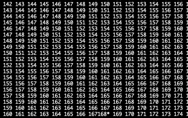

# Environmenent : 

### Paramètres 
* Size `--size`(10)
* Taille d'un épisode `--t` (1000)
* Nombre d'épisode `--n`(10000)
* Nombre d'itérations N pour approximer J `--nb_iterations` (1000)
* Gamma `--discount_factor`(0.99)
* Alpha `--learning ratio`(0.05)
* Epsilon `--epsilon`(0.5)
* batch size `--batch_size`(1000)

## Sparse 
Marche bien mieux pour des plus petits environement. Très dépend du nombre d'itérations réalisé.

* Reward sparse = 0
* Pas de chemin optimal trouvé
* 51 sec de passé.
* End position pas toujours explorée

## Heuristics
Heuristics utilisé: mahantan distance inversé pour que le plus proche de la fin soit le mieux.

Reward plus grand attribué à la dernière étape.

* Reward heuristics = 169864. Mais pas d'optimal policy trouvé. Ils préfèrent stagner à l'avant derniere :

* Temps exec : 5.49 sec
	* Arrive particulièrement quand la solution est difficile à trouver. Si on a une taille plus grand, il va se caler contre un mur et répéter la même étape..
	* Excatement comme prévu, pour size = 100, il fait une boucle de 4 étapes dans les valeurs optimales en bas a droite : **Haut > droite > Bas > gauche > ..**
   
* La end position est bel et bien exploré mais elle n'est pas choisie.
* Ce phénomène arrive lorsque la reward de fin est inférieur à (N - le nombre d'étape pour rejoindre l'état de boucle) * reward de l'état de boucle

Ici la solution pour arriver à ne pas avoir le problème est super simple: mettre une très grande reward à l'état de fin.

Le problème c'est que cette solution ne permet de prendre en compte qu'un seul aspect de l'apprentissage, ici gagner. Mais si on veut gagner avec differents critères, cela devient plus dur et une balance complexe entre les différents élément qui constitute notre récompense totale doit être équilibré.
Dans notre cas, on pourrait donner une récompense très grande lorsque tous les ennemis sont morts et très petits lorsques les alliés sont morts. 

Imaginons cependant que nous voulions récompensé le nombre de personne vivante. Avec une heuristique simple, une solution pourrait être de simplement éviter le combat car a chaque time step, on aurait une récompense plus grande. Pour éviter cette situation, il faudrait donner une récompense immense lorsque tous les enemis soient tués. Cependant, celle-ci devrait être tellement grande qu'elle prendrait le dessus sur tout, et éblouirait toutes subtilité possible.

Ceci est d'autant plus vrai que notre situation n'est pas limité en temps! Techniquement, avec suffisament de temps, les cycles pourraient matchs n'importe quel type de récompense. Il faudrait augmenter la reward totale proportionnellement au temps maximale de mission qui n'est pas définit de manière stricte.. 

Un autre solution est le potential-based reward shaping
## PBRS 
On utilise l'heuristic mais on applique le PBRS

Résultat impressionnant :

* Reward = maximale
* Temps d'exécution : 1.86 sec
* Chemin optimale trouvé.
* End position évidement explorée.

## Cas où on met une reward de 500 dans la grille

### Heuristics
Avec assez d'exploration, va bouclé dessus, logiquo logique!

### PBRS

Meme si l'état est exploré, il n'est pas choisis forcément. Pourquoi?
Car le gradient va être ultra positif dans un sens mais ultra négatif dans l'autre sens.. Donc pas rentable.

Le PBRS est utile seulement lorsqu'on s'approche graduellement vers la reward.
Une solution est de mettre la reward à normale une fois que l'état a été exploré.

Ne marche pas pour some reasons. A explorer ..